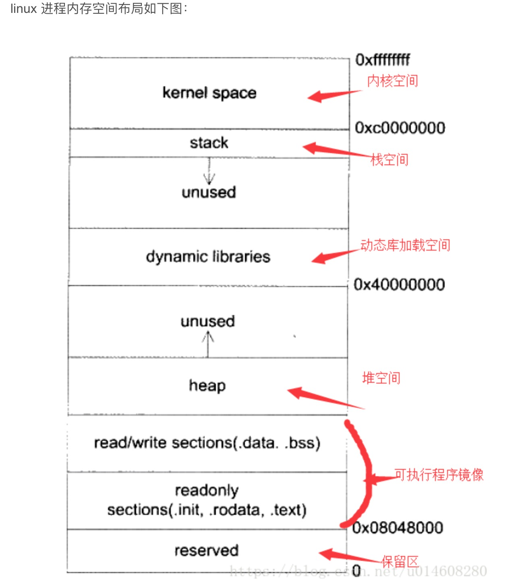

# 深入理解堆与栈

大多数操作系统会将内存空间分为内核空间和用户空间，而每个进程的内存空间又有如下的“默认”区域。

1、栈：栈用于维护函数调用的上下文，离开栈函数调用就会无法实现。栈通常在用户空间的最高地址处分配，通常有数兆字节。

2、堆:堆用来容纳应用程序动态分配的内存区域，我们使用malloc 或者new分配内存时，得到的内存来自堆里。堆通常存于栈的下方（低地址方向），堆一般比栈大很多，可以有几十至数百兆字节的容量。

3、可执行文件镜像：可执行文件由装载器在装载时将可执行文件读取到内存或者映射到内存。

4、保留区：保留区并不是一个单一的内存区域，而是对内存中受保护而禁止访问的内存区域的总称，例如，大多说操作系统中，极小的地址通常都是不允许访问的，如NULL。（顺便提一下，我们编程的时候经常会遇到‘段错误（segment fault）’或者‘非法操作，该内存地址不能read/write’的错误信息，其中一个原因就是我们初始化了一个指针为NULL但是没有给它赋合理的值就开始使用它。）

## 栈

栈总是向下增长的。栈保存了一个函数调用所需的维护信息，常常被称作堆栈帧或者活动记录。

堆栈帧包含：

函数的返回地址和参数

临时变量：包括函数的非静态局部变量以及编译器自动生成的其他临时变量。

保存的上下文：包括在函数调用前后需要保持不变的寄存器。

函数的返回值是通过eax寄存器返回的，但是eax寄存器只有4字节，如果返回值在5-8字节范围内，几乎所有的调用惯例都是采用eax和edx联合返回的，eax存储返回值的低4字节，其他的字节在edx中存储。
如果是大于8字节的，eax中返回的是地址，然后在去把地址里面的内容拷贝出来。

整数值或内存地址，是通过EAX寄存器返回的。对于较小的结构体或对象，可以通过EAX:EDX寄存器对返回。对于超大的对象或结构体，caller在调用函数之前会分配出内存空间，然后把这个空间地址作为第一个参数隐式地传给函数。被调用的函数callee把结果写进这片内存空间，然后pop空间地址，然后返回。
（这里就是说很多编程语言，函数声明的时候需要声明返回类型。而JavaScript函数不用指定返回类型，是否表示其他的处理方式？）

## 堆

栈上的数据在函数返回时就会被释放掉，所以无法将数据传至函数外部，而全局变量没有办法动态地产生，只能在编译的时候定义，在这种情况下，堆是唯一地选择。
